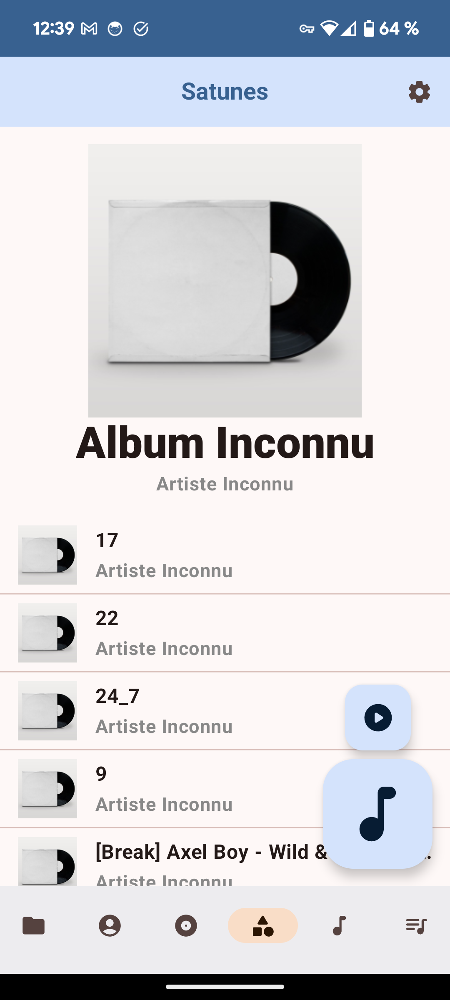
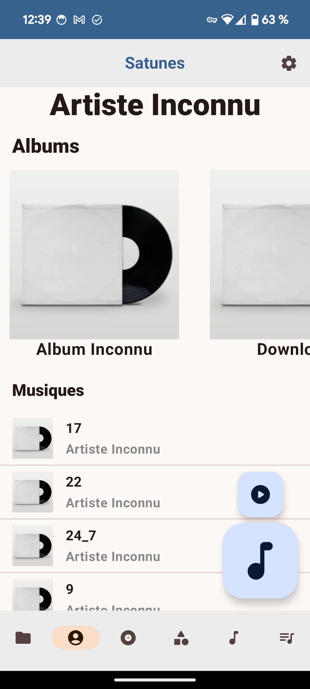
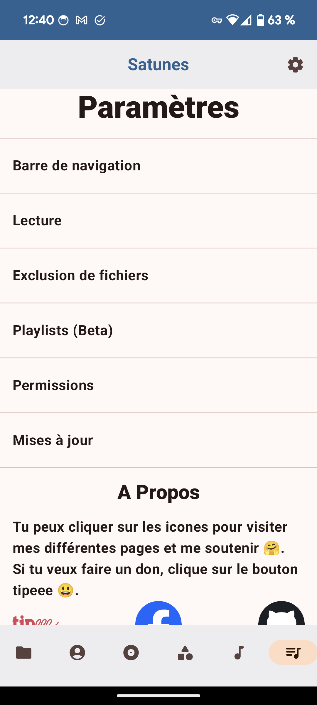

  

<h1 align="center">Satunes (🇬🇧)</h1>

Vous pouvez retrouver ce fichier en [français 🇫🇷](README.md)

Satunes is a mp3 player on Android. Use it to listen your music from your audio files stored in your Android phone (Android Lollipop 5.1.1 and later).
This application is still in development and contains bugs and bad ui.

This entire project is under GNU/GPL v3 and it's applied on all version of this project (even the code pushed from the very first commit.).

If you decide to use my code to create new app, you can but you have to use the same license :p

# Screenshots

  
  

  
  
  
  
  
  
  
  
  

# Installation

## Application

1) Click on [Release](https://github.com/antoinepirlot/MP3-Player/releases)
2) Choose your version
3) Click on "Assets" to deploy a menu that contains the installation file.
4) Click on the file Satunes_vx.y.z.apk (A file will be downloaded on your device).
5) Once the file is downaloded, open it.
6) Allow the unknwon application installation (It's required as the app is not deployed on the Play Store).
7) Install the app (it is likely that you will have to start step 5 again).
9) I recommand you to disable unknown app installation for the app from where you installed the app.
10) Enjoy you music freely :D

## Android Auto
    
1) Go to Android Auto settings.
2) Multiple click on "Version" to activate dev mode. 
3) Go to Dev's settings and activate "Unknown sources" as this app is not published on Google Play Store.
4) Click on the 3 buttons as in point 3, but click on "Exit developer mode" the setting you just activated will be saved.
5) Add app in launcher.
6) Enjoy

##

If you like the app and want to support me click [here](https://tipeee.com/antoinepirlot).

# Releases
If you want to know about different releases and what they added, [click here.](RELEASES_EN.md)
