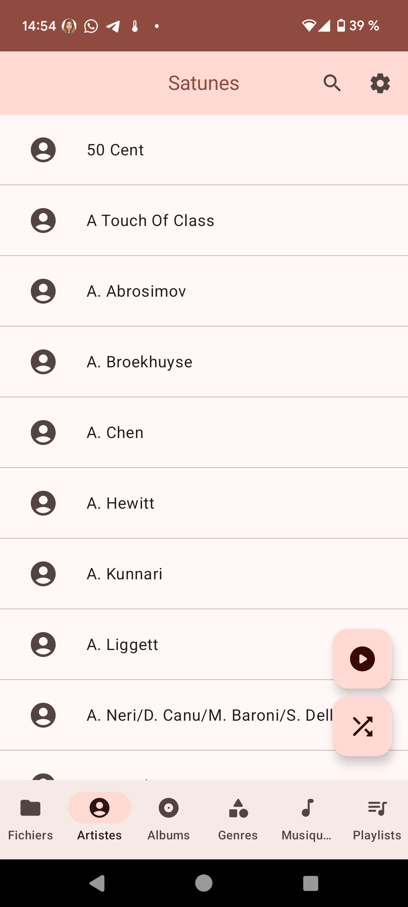
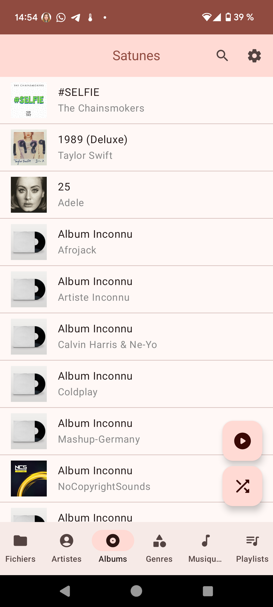
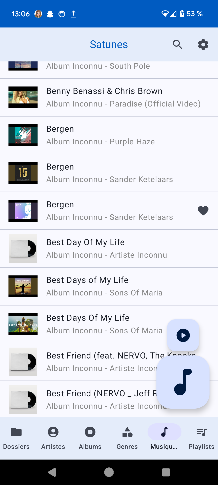

  

<h1 align="center">Satunes (🇫🇷)</h1>

  
   
  

You can find this file in [english 🇬🇧](README_EN.md).

<h1>Compte tenu des circonstances actuelles, les Etats-Unis ont montrés qu'ils sont une menace pour l'Ukraine 🇺🇦, l'Union Européenne 🇪🇺 et nos démocraties.  
Nous sommes trop dépendants des américains, j'encourage donc chaque citoyen européen à utiliser des produits européens quand c'est possible et d'en créer de nouveaux quand il n'y a pas d'alternatives.  
L'Europe est unie dans la diversité, ne les laissons pas nous diviser!  
Longue vie à l'Union Européenne 🇪🇺, Хай живе Україна 🇺🇦 et à la démocratie.</h1>

Satunes est un lecteur de musique pour Android. 
Tu peux l'utiliser pour écouter ta musique présente sur ton appareil Android. (Android Lollipop 5.1.1 et plus récent).

L'entierté du projet est sous la licence GNU/GPL v3 et s'applique à toutes les versions de ce projet y compris le code ajouté avant l'introduction de la licence.

Tu as le droit de réutiliser mon code pour créer une nouvelle application dérivée mais tu devras impérativement le republier sous la même licence afin de faire prospérer le logiciel libre 🗽.

# Aperçu

    
    
    
    
    
    
    
    
    
    
    
    
    
    
    
    

# Fonctionnalités

* Lire la musique sur le téléphone et sur Android Auto
* Voir les artistes et leurs albums et musiques
* Voir les genres et leurs albums et musiques
* Lire la musique en fonction des dossiers, albums, genres et artistes
* Système de playlists
* Exportation et importation des playlists
* Personnalisation de l'expérience:
  * Arrrêter ou continuer la lecture si l'application est fermée
  * Mettre sur pause ou non si:
    * une autre application joue un autre audio
    * Les écouteurs sont débranchés (bluetooth et câble)
  * Choix de la vitesse du rafraichissement de la barre de progresssion
  * Choix des modes de lectures par défaut
  * et d'autres encore.
* Choisir les dossiers à inclure ou exclure
* Mettre la musique en pause après un certain temps
* Partager les fichiers musicaux avec les autres
* Faire une recherche dans ta bibliothèque
* Mises à jour au sein de l'application
* ...

# Installation
Pour installer facilement, tu peux télécharger l'application sur Fdroid en cliquant sur le bouton ci-dessous.

  

Sinon, tu peux également suivre les étapes suivantes:

## Application

1) Clique sur [Release](https://codeberg.org/antoinepirlot/Satunes/releases)
2) Choisi ta version
3) Clique sur "Assets" pour dérouler un menu qui contient le fichier d'installation
4) Clique sur le fichier Satunes_vx.y.z.apk (Un fichier va se télécharger sur ton appareil)
5) Une fois le téléchargement terminé, ouvre le fichier
6) Autorise l'installation d'application inconnue. (C'est nécéssaire car l'application n'est dépployée sur le Play Store).
7) Installe l'application (il est probable que tu doives recommencer l'étape 5).
8) Je te recommande de désactiver l'installation d'applis inconnue de l'application depuis laquelle tu as ouvert le fichier.
9) Profite de ta musique en toute liberté :D

## Android Auto

1) Va dans les paramètres de Android Auto.
2) Cliques plusieurs fois sur le bouton "Version" pour activer les paramètres développeurs.
3) Va dans les paramètres développeurs en cliquant sur les 3 boutons en haut à droite et active le paramètre "Sources Inconnues" car mon application n'est pas publiée dans le Google Play Store.
4) Clique sur les 3 boutons comme au point 3, mais clique sur "Quitter le mode développeur" le paramètre que tu viens d'activer sera enregistré.
5) Il n'y a plus qu'à ajouter l'application au lanceur d'application de Android Auto dans le menu "
   Personnaliser le lanceur" et le tour est joué.
6) Bonne écoute et bon voyage ;)

## Soutien

Si l'application te plait et que tu as envie de me soutenir, n'hésite pas à le faire [ici](https://liberapay.com/antoinepirlot/).

# Versions
Si tu souhaites voir les différentes versions de l'application et ce qu'elles contiennent, [clique ici.](RELEASES_FR.md)
