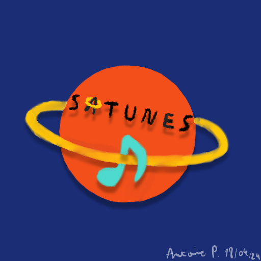
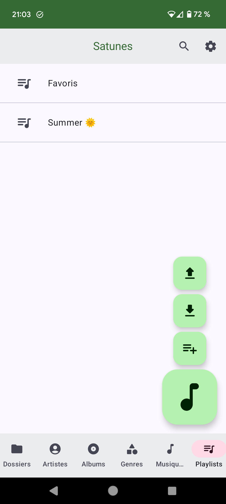
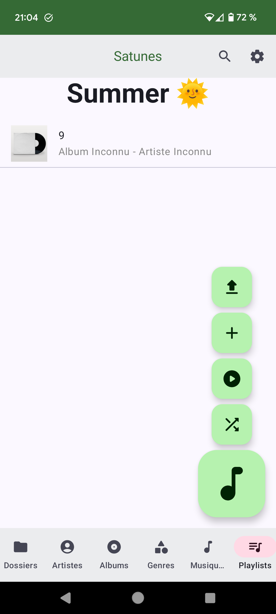
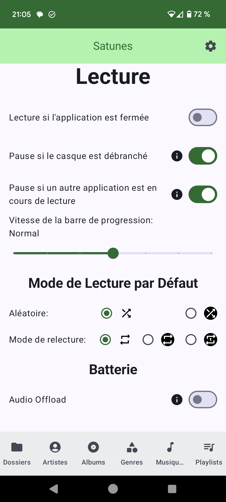
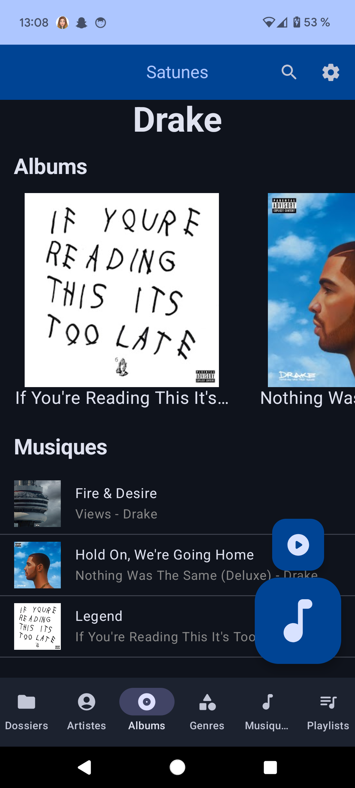
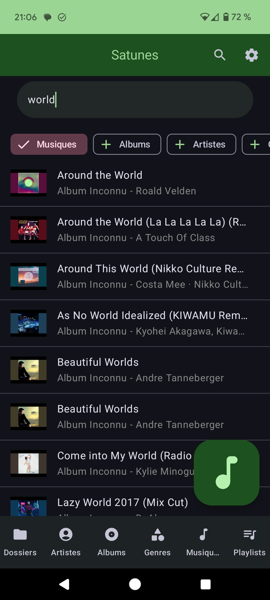

  

<h1 align="center">Satunes (🇬🇧)</h1>

  

  
  

Vous pouvez retrouver ce fichier en [français 🇫🇷](README.md)

<h1>As the United States threatens Ukraine 🇺🇦, the European Union 🇪🇺 and our democracies, I have decided to boycott most American products.   
I encourage every European citizen to use European products when possible and to create new ones when there are no alternatives.  
Let's not let them divide us!  
Long live the European Union 🇪🇺, Хай живе Україна 🇺🇦 and democracy.</h1>

Satunes is an mp3 player on Android. Use it to listen your music from your audio files stored in your
Android phone (Android Lollipop 5.1.1 and later).

This entire project is under GNU/GPL v3 and it's applied on all versions of this project (even the
code pushed from the very first commit.).

You can reuse my code but you will have to redistribute it. This allows free software to prosper 🗽.

# Screenshots

    
    
    
    
    
    
    
    
    
    
    
    
    
    
    

# Features

* Play music on phone and on Android Auto
* View artists and their albums and music
* View genres and their albums and music
* Playlists
* Play music based on folders, albums, genres, artists and playlists
* Export and import playlists
* Personalization of the experience:
    * Stop or continue playing music if the app is closed
    * Pause or not if:
        * another app plays another audio
        * Headphones are unplugged (bluetooth and cable)
    * Choice of progress bar refresh speed
    * Choice of default playback modes
    * And more
* Choose folders to exclude or include
* Puse music after a moment
* Share your music's files with others
* Search into your library
* In-app updates

# Installation

To install easily, you can download the application from Fdroid by clicking on the button below.

  

Otherwise, you can also follow the following steps:

## Application

1) Click on [Release](https://github.com/antoinepirlot/Satunes/releases)
2) Choose your version
3) Click on "Assets" to deploy a menu that contains the installation file.
4) Click on the file Satunes_vx.y.z.apk (A file will be downloaded on your device).
5) Once the file is downaloded, open it.
6) Allow the unknwon application installation (It's required as the app is not deployed on the Play
   Store).
7) Install the app (it is likely that you will have to start step 5 again).
9) I recommand you to disable unknown app installation for the app from where you installed the app.
10) Enjoy you music freely :D

## Android Auto

1) Go to Android Auto settings.
2) Multiple click on "Version" to activate dev mode.
3) Go to Dev's settings and activate "Unknown sources" as this app is not published on Google Play
   Store.
4) Click on the 3 buttons as in point 3, but click on "Exit developer mode" the setting you just
   activated will be saved.
5) Add app in launcher.
6) Enjoy

##

If you like the app and want to support me click [here](https://tipeee.com/antoinepirlot).

# Releases

If you want to know about different releases and what they added, [click here.](RELEASES_EN.md)
